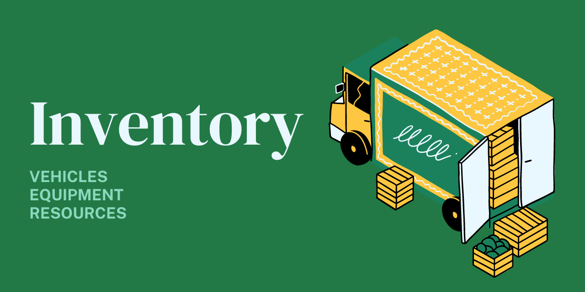

# Inventory 📦

> An inventory service for managing farming vehicles, equipment, and resources.



## What is this?

- A REST API for managing farm inventory via HTTP requests
- A gRPC Service for managing farm inventory via RPC requests
- A CLI for managing farm inventory

The inventory service enables users to keep track of farm inventory across multiple IoT devices, servers, applications, or databases. This service provides a foundational interface for inventory management and interaction.

## Structure

```shell
/cmd/inventory # http api server
/cmd/inventoryctl # cli tool for service administration
/config # default application configurations
/ent # database models, migrations, and drivers
/ent/schemas # editable database models
/internal/settings # settings package to read in application configs
```

## Quickstart ⚡

[](https://railway.app/new/template?template=https%3A%2F%2Fgithub.com%2Fopen-farms%2Finventory&plugins=postgresql&referralCode=XwTg6R)

You can either install inventory directly with go, build the project from source, or [download a binary from the latest release](https://github.com/open-farms/inventory/releases)

### Docker Compose

```shell
# Start the database and API via docker-compose
docker-compose up

# List the vehicles
http :8000/v1/vehicles
```

Install with `go install`

```shell
# Install the server
go install github.com/open-farms/inventory/cmd/inventory@latest

# Install the admin cli
go install github.com/open-farms/inventory/cmd/inventoryctl@latest
```

## Start the service 🏃

Start the service directly with the binary or run it containerized with Docker.

```shell
# Run the inventory service
inventory
```

```shell
# Build the docker image
docker build -t <your-docker-image-name> .

# Run the docker image, exposing the service
docker run --rm -v ./config:/data/config -p 8000:8000 <your-docker-image-name>
```

## Manage the inventory database with the [inventoryctl](./cmd/inventoryctl) CLI

```shell
# Start the postgres database
docker-compose up

# Run the inventoryctl cli to perform database migrations
inventoryctl --help
inventoryctl migrate
```

## Generate code and build from source 🏗️

Generate the service code, openapi spec, and build from source

```
make init
make generate
make test
make build
```

## Services

[View the openapi specification](./openapi.json)

[View the protobuf schemas and services](./ent/proto/entpb/entpb.proto)
